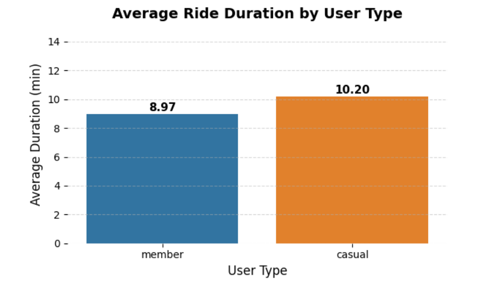
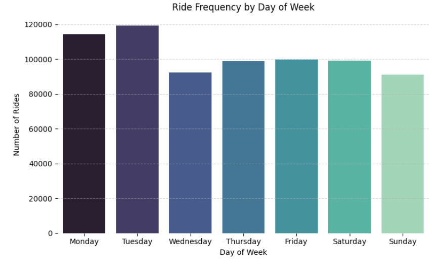
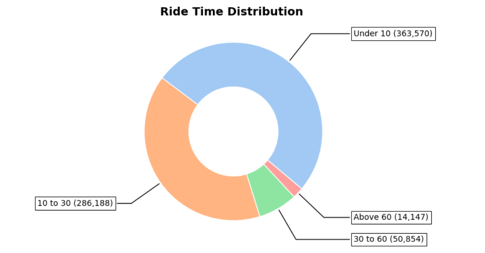
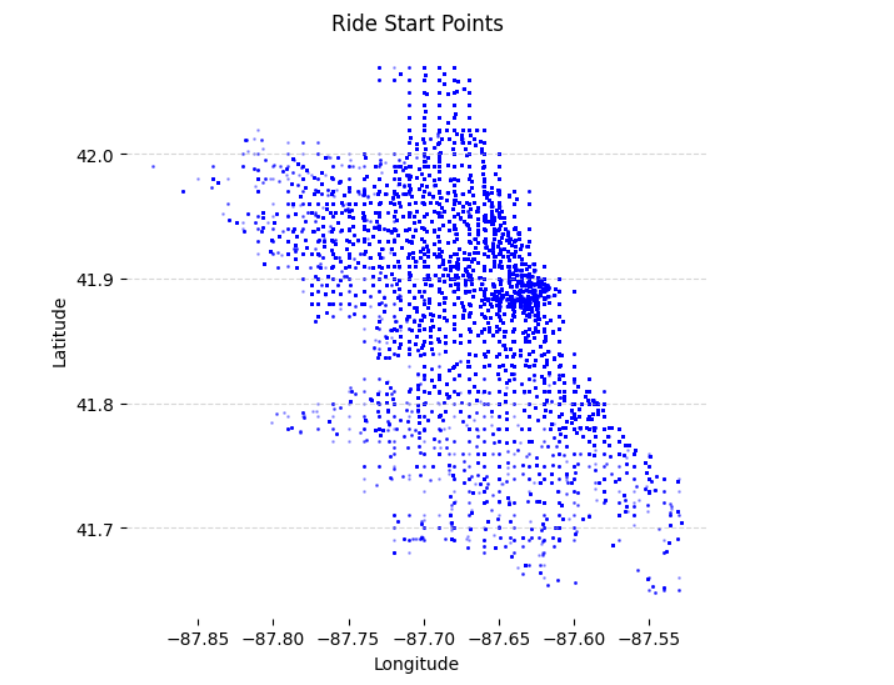
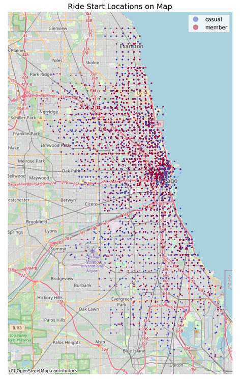
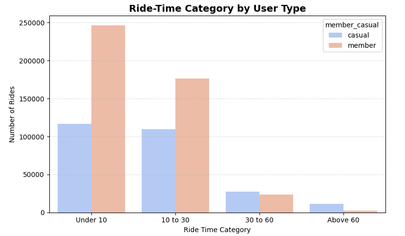

# 🚴 Cyclist Ride Patterns Analysis

Welcome to the **Cyclist Ride Patterns Analysis** project!  
Here, we explore how city residents use bike sharing services and what insights we can draw from members vs casual riders. This analysis follows the **Coursera Data Analytics Specialization workflow**: **Ask → Prepare → Process → Analyze → Share**.

---

## 1️⃣ Ask

**Main Questions:**
- Who rides longer: members or casual riders?  
- Which days and hours are most popular?  
- How do ride durations vary?  
- Where do rides start geographically?  
- Which ride types are preferred by members vs casuals?

**Goal:** Help ride-sharing operators optimize operations, marketing, and station placement while understanding rider behavior.

---

## 2️⃣ Prepare

**Dataset:** [`Cyclist.csv`](https://divvy-tripdata.s3.amazonaws.com/202509-divvy-tripdata.zip)  
- ~715k rides for the month of september (2025). 
- Key columns: `ride_id`, `rideable_type`, `started_at`, `ended_at`, `start_station_name`, `end_station_name`, `start_lat`, `start_lng`, `end_lat`, `end_lng`, `member_casual`

### 1. Handled datetime properly
- Separated `started_at` and `ended_at` into **date** and **time** components.  
- Converted these columns to proper `datetime` format for accurate calculations.

### 2. Calculated ride duration
- Subtracted `started_at` from `ended_at` to get **total ride duration in minutes** (`total_time_min`).  
- Initially calculated in **Excel**, then imported back for further analysis.

### 3. Removed invalid rides
- Dropped rides with **negative durations** (~2,673 rows).  
- Removed rides with **missing start or end stations** (~160k rows) to ensure reliable location analysis.

### 4. Created derived columns for analysis
- `started_day` → Day of the week for each ride (Monday, Tuesday, …)  
- `started_hour` → Hour of the day for each ride (0–23)  
- `ride_time` → Categorized rides based on duration:
  - `Under 10` minutes  
  - `10 to 30` minutes  
  - `30 to 60` minutes  
  - `Above 60` minutes  
- `rideable_type` → Distinguishing **classic bikes** vs **electric bikes**  

### 5. Additional data transformations
- Aggregated rides by **user type** (`member` vs `casual`)  
- Calculated **mean, median, min, max durations** per user type  
- Prepared data for **day-of-week and hourly trends**  
- Created **geospatial points** for mapping ride start locations  
---

## 3️⃣ Process

Aggregated data to answer our questions:  
- Mean and median ride durations by user type  
- Ride counts by day of week and hour of day  
- Ride-time category counts by user type  
- Rideable type usage by members vs casuals  
- Geospatial points for mapping ride starts

---

## 4️⃣ Analyze

### **Average Ride Duration by User Type**

  

> **Insight:** Casual riders tend to take slightly longer rides (~10.2 min) compared to Members (~9 min).  

---

### **Ride Popularity by Day of Week**

  

> **Insight:** Tuesday and Monday are the busiest days, while Sunday sees the least traffic.  

---

### **Ride-Time Category Distribution**

  

> **Insight:** Most rides are short (`Under 10` minutes). Longer rides (`Above 60` min) are rare.  

---

### **Ride Start Points (Scatter Plot)**

  

> **Insight:** Ride activity is concentrated in central city areas, indicating popular routes and high-demand zones.  

---

### **Ride Start Locations on Map**

  

> **Insight:** Visual map highlights clusters of rides. Members vs casuals are color-coded, showing differing usage patterns geographically.  

---

### **Ride-Time Category vs User Type**

  

> **Insight:** Members prefer medium-duration rides (`10–30 min`) and electric bikes. Casuals use classic bikes more and take longer rides.  

---

### **Summary Table**

| User Type | Total Rides | Mean Duration (min) | Median Duration (min) | Min Duration | Max Duration |
|-----------|------------|------------------|--------------------|-------------|-------------|
| casual 	  | 265461 	   |  10.204019 	    | 11.39 	           |-1439.51 	   | 1210.41     |
| member    |	449298 	   |  8.965965 	      | 9.09 	             |-1438.83 	   | 1065.83     | 

> **Insight:** Casual riders not only take longer rides, but they also have slightly more variability in ride durations.  

---

## 5️⃣ Share

**Key Takeaways:**
- Casual riders take longer rides and prefer classic bikes.  
- Members dominate weekday usage and prefer electric bikes.  
- Peak ride hours align with commute times: 16:00–18:00.  
- Visualizations can inform station placement, promotions, and city planning.  

---

### **6️⃣ Tools & Libraries**
- Python 3.x, Jupyter Notebook  
- pandas, numpy, seaborn, matplotlib, geopandas, contextily  

---

### Future Analysis**
- Explore ride trends by **season/month**  
- Investigating **station-to-station ride flows**  
- Predicting **ride demand** for new stations  
- Analyzing **pricing or promotions impact** on casual vs member behavior  

---

> This project is designed to tell a **story with data** by making it easy to understand patterns without drowning in statistics jargon.  
